### Prefabs

#### Player
- **Nome**: Player
- **Descrição**: Prefab principal do jogador jogável, contém animações e controles
- **Quando são utilizados**: Durante toda a sessão de jogo

**Sprite do Jogador:**
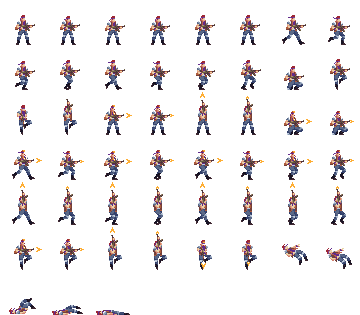

**Companion:**
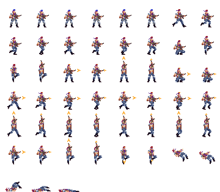

- **Quais seus componentes**:
    - Sprites: `SpriteSheet_player.png`, `SpriteSheet_player_sliced.png`, `companion.png`
    - Animações:
        - `Idle.anim` - Personagem parado
        - `Run.anim` - Personagem correndo
        - `Die.anim` - Animação de morte
        - `JumpShoot_D.anim` - Pulo e tiro para baixo
        - `JumpShoot_S.anim` - Pulo e tiro para cima
        - `run_shoot_up.anim` - Corrida e tiro para cima
    - Colisores: Para detecção de colisão com inimigos e objetos
    - Fontes de audio: Sons de movimento, tiros e morte
    - Scripts: Controle de movimento, sistema de tiro, gerenciamento de vida

#### Inimigos (Enemies)
- **Nome**: Boss, Enemies (múltiplos tipos)
- **Descrição**: Prefabs dos inimigos com padrões de movimento e ataque

**Tipos de Inimigos:**

**AR Mob (Assalto):**
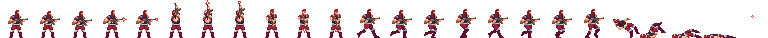

**RPG Mob (Foguete):**
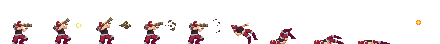

**Sniper Mob (Elite):**
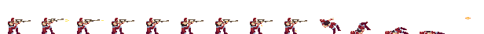

**Explosão (Partículas):**
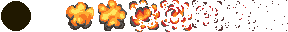

- **Tipos**:
    - `Boss` - Chefe final
    - `ARMob.png` - Inimigo com arma de assalto
    - `RPGmob.png` - Inimigo com RPG
    - `SniperMob.png` - Inimigo atirador de elite
    - `Explosion_Particle.png` - Efeitos de explosão
- **Quando são utilizados**: Durante fases de combate
- **Componentes comuns**:
    - Sprites: Diferentes para cada tipo de inimigo
    - Colisores: Para detecção de colisão
    - Scripts: IA, padrões de ataque, vida

#### Chefe (Boss)
- **Nome**: Boss
- **Descrição**: Tanque azul controlado por script ou jogador

**Tanque Azul:**
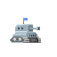

**Tanque Virado para Esquerda:**
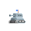

- **Sprites**:
    - `tankblue.png` - Sprite base do tanque
    - `tank_left.png` - Tanque virado para esquerda
    - `left_move_blue-Sheet.png` - Movimentação para esquerda
    - `right_move_blue-Sheet.png` - Movimentação para direita
    - `left_fire_blue-Sheet.png` - Tiro para esquerda
    - `right_fire_blue-Sheet.png` - Tiro para direita
    - `left_explode_blue-Sheet.png` - Explosão para esquerda
    - `right_explode_blue-Sheet.png` - Explosão para direita
- **Quando é utilizado**: Na fase final do jogo
- **Componentes**:
    - Sprites em sheet para animação
    - Colisores avançados
    - Scripts de IA agressiva
    - Sistema de vida complexo

### Tile Palettes

#### OutPalette
- **Nome**: OutPalette
- **Descrição**: Paleta de tiles para ambientes externos (mapa de rua)

**Tiles Externos:**
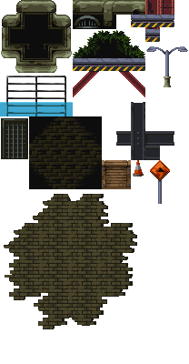

- **Arquivo**: `tiles_out.png`
- **Quantidade de tiles**: 206+ assets gerados
- **Uso**: Construção de cenários externos/rua
- **Componentes**:
    - Assets gerados: `tiles_out_0.asset` até `tiles_out_206.asset`
    - Prefab: `OutPalette.prefab`
    - Ground Runtime: `RTGround.asset`

#### SubwayPalette
- **Nome**: SubwayPalette
- **Descrição**: Paleta de tiles para ambiente de metrô/subterrâneo

**Tiles Metrô:**
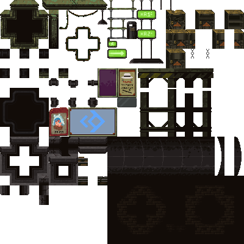

- **Arquivo**: `Subway_tiles.png`
- **Quantidade de tiles**: 434+ assets gerados
- **Uso**: Construção de cenários internos/metrô
- **Componentes**:
    - Assets gerados: `Subway_tiles_0.asset` até `Subway_tiles_434.asset`
    - Prefab: `SubwayPalette.prefab`

### Elementos Visuais Adicionais

#### Clouds (Nuvens)

**Nuvens Decorativas:**

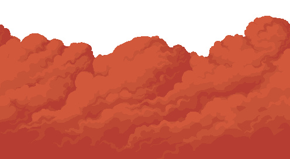

- **Sprites**:
    - `nuvens_1.png` - Primeira variação de nuvem
    - `nuvens_2.png` - Segunda variação de nuvem
    - `nuvens_3.png` - Terceira variação de nuvem
- **Uso**: Decoração de fundo nos ambientes externos